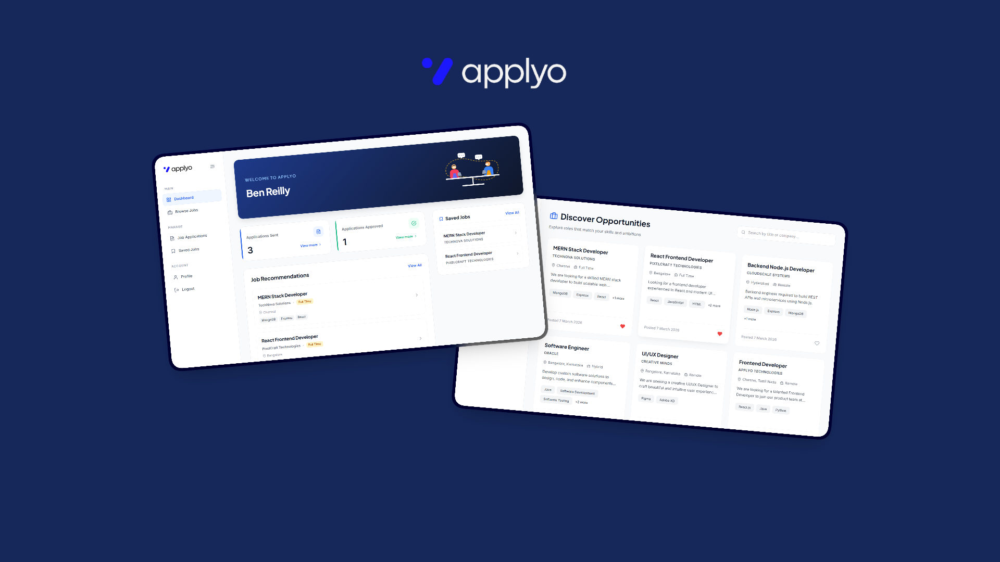

# Applyo — Job Portal

> **Land what you love.** A full stack job portal that connects job seekers with top recruiters.

---


---
## 🌐 Live Demo

- **Frontend** → [applyojobs.vercel.app](https://applyojobs.vercel.app)
- **Backend** → [applyo-backend-9eu8.onrender.com](https://applyo-backend-9eu8.onrender.com)

---

## 📌 About the Project

Applyo is a full stack job portal web application where job seekers can discover and apply for jobs, track their applications, and save opportunities for later. Recruiters can post jobs, manage applicants, and update application statuses — all in one place.

---

## 🛠️ Tech Stack

### Frontend
| Technology | Purpose |
|------------|---------|
| React.js | UI Library |
| Vite | Build Tool |
| Tailwind CSS | Styling |
| Axios | API Calls |
| React Router DOM | Client Side Routing |
| React Icons | Icons |

### Backend
| Technology | Purpose |
|------------|---------|
| Node.js | Runtime Environment |
| Express.js | Web Framework |
| MongoDB | Database |
| Mongoose | ODM |
| JWT | Authentication |
| Bcrypt | Password Hashing |
| Multer | File Uploads |
| Express Rate Limit | API Rate Limiting |

### Deployment
| Service | Purpose |
|---------|---------|
| Vercel | Frontend Hosting |
| Render | Backend Hosting |
| MongoDB Atlas | Cloud Database |

---

## ✨ Features

### 👨‍💼 Job Seeker
- Register and login as a Job Seeker
- Browse and search all available jobs
- Apply for jobs with a single click
- Track status of all applications (Pending, Accepted, Rejected)
- Save interesting jobs for later
- View and update profile
- Upload resume

### 🏢 Recruiter
- Register and login as a Recruiter
- Post new job listings
- Edit and delete job postings
- View all applicants for each job
- Update application status (Accept / Reject)
- View recruiter dashboard with stats and recent applications

---


## ⚙️ How to Run Locally

### Prerequisites
```
Node.js installed
MongoDB Atlas account
Git installed
```

### 1. Clone the Repository
```bash
git clone https://github.com/nithish-github07/Applyo.git
cd Applyo
```

### 2. Setup Backend
```bash
cd backend
npm install
```

Create a `.env` file inside `backend/`:
```env
MONGO_URI=your_mongodb_connection_string
JWT_SECRET=your_jwt_secret_key
PORT=5000
CLOUDINARY_CLOUD_NAME=your_cloudinary_cloud_name
CLOUDINARY_API_KEY=your_cloudinary_api_key
CLOUDINARY_API_SECRET=your_cloudinary_api_secret
EMAIL_USER=your_email_id
EMAIL_PASS=your_app_password
```

Start the backend:
```bash
npm run dev
```

### 3. Setup Frontend
```bash
cd frontend
npm install
```

Create a `.env` file inside `frontend/`:
```env
VITE_API_URL=http://localhost:5000/api
```

Start the frontend:
```bash
npm run dev
```

### 4. Open in Browser
```
http://localhost:5173
```

---

## 🚀 Future Enhancements

-  Resume parser to auto fill profile details
-  Advanced job search with filters (salary, location, job type)
-  Chat system between recruiter and job seeker
-  Job recommendations based on profile and skills
-  Google and LinkedIn OAuth login
-  Admin dashboard to manage users and jobs
-  Mobile app using React Native

---

## 👨‍💻 Author

**Nithish S**
- GitHub → [@nithish-github07](https://github.com/nithish-github07)
- Linkedin -> [@nithish0405](https://www.linkedin.com/in/nithish0405)

---

## 📄 License

This project is open source and available under the [MIT License](LICENSE).